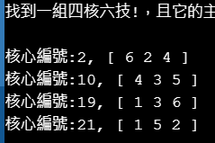
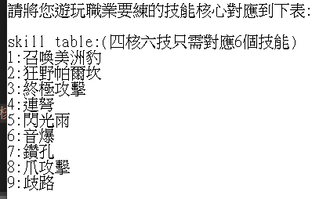
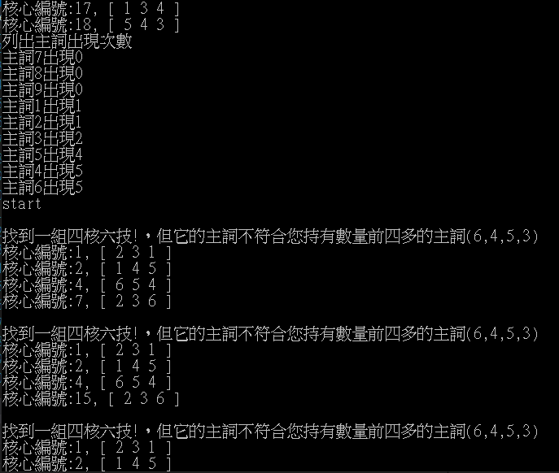
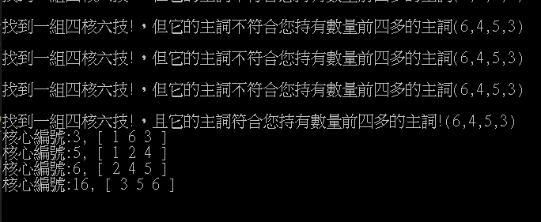

# MapleStoryFindCore
楓之谷完美核心計算機  

# 原理簡介:
## 完美核心
每顆被動核心寶石包含三個技能，其中有一個技能是主詞。四核六技就是同時裝四顆主詞不重複的核心寶石，且只會有六個技能出現，每個技能都剛好出現兩次。
## 暴力搜尋
程式使用樹狀搜尋法(暴力法)來逐一檢視所有的p(n,4)的組合，遇到合格的組合就會記錄下來或跳出。樹的走訪是深度優先(未拜訪的節點存在呼叫堆疊)，樹的深度最深為4，寬度則是(n - 當前深度)。六核九技也是類似作法。
# 使用說明:
## 1. 
開個記事本，自行將自身職業要練的6個核心對應到數字1-6，六核九技對應1-9。  

## 2. 
將Source.cpp貼到c++ compiler
## 3.   
在程式碼前幾行找到這兩個變數:  
```c
char mode = '1';
char enumerate = '2';
```
mode設定'1'找4核6技 ,'2'找 6核9技  
enumerate設 '1' 列出所有解,設'2' 列第一組合乎成本解,設'3'列第一組解  

## 4. 
往下看到  
```c
char s1[1000] = "231,145,163,654,124,245,236,124,003"
```
依照剛才建立的對應，以數字表示持有的核心，把自己持有的寶石輸進去(這很耗時我知道QQ)  
一顆核心用"ABC"表示，注意技能主詞必須是C(很重要，程式只檢查C來看主詞不重複)，ABC都是1到6(六核九技則為1到9)的整數，按照對應表對應到技能  
```ps
例如 : 連弩/閃光箭雨/終極攻擊  
終極攻擊為主詞  
因此"453"表示"連弩/閃光箭雨/終極攻擊"  
```
  
另外如果有核心含有沒用的技能，但是它的主詞是有用的，則沒用的技能標0，(這樣可以算進主詞統計，之後有機會給別的核心吃)。如範例中的"003"，代表3是你要的主詞，但前面兩個技能是沒用的。  


## 5. 
最後按RUN就可以看結果囉  
- 若enumerate選`1`  
會印出所有解(可能會比較久，不建議)  
  
- 若enumerate選`2`  
會嘗試找出第一組值得投資的解(因為核心直接互吃，會比分掉重新合划算)  

- 若選'2'但都沒有值得投資的解，請選'3'，會找出第一組解


